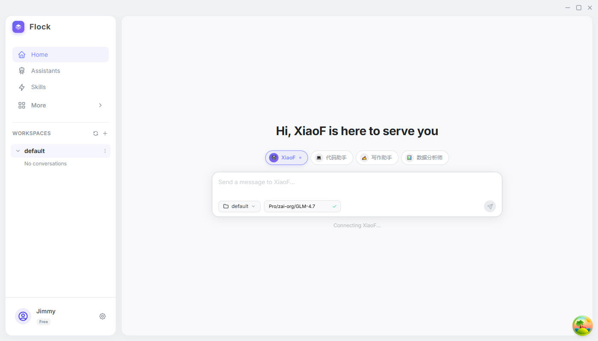

# Skein

English | [简体中文](docs/README_zh.md)

A multi AI agent desktop application built with Rust and Tauri.



> **Note**: This project is built on top of [langgraph-rust](https://github.com/Onelevenvy/langgraph-rust), which is my personal Rust implementation of the LangGraph framework.

> **Refactoring History**: Skein has been completely rewritten from the ground up. The original version was a Python-based application using LangGraph, LangChain, and FastAPI as the backend. The current version is a native desktop application with a Rust backend, powered by Tauri for the desktop shell. This rewrite brings significant improvements in performance, reliability, and user experience.

> **Legacy Code**: The original Python codebase is preserved in the `legacy/python` branch for reference.

## Overview

Skein is a desktop application that provides an interactive interface for AI agents with tool orchestration capabilities. It supports multiple LLM providers and features a rich set of built-in tools, skills system, and memory management.

## Features

- **Multi-Provider Support**: OpenAI-compatible, Anthropic, AWS Bedrock, Google Vertex
- **Tool Orchestration**: Built-in tools (Read, Write, Edit, Bash, Grep, Glob) + MCP server integration
- **Skills System**: Reusable prompt templates with YAML frontmatter, hot-reload support
- **Memory System**: Persistent cross-session memory (user, feedback, project, reference types)
- **Session Management**: Conversation history with SQLite-backed persistence
- **Desktop UI**: Modern interface built with React, TypeScript, and Mantine UI
- **Internationalization**: Multi-language support (Chinese/English)

## Architecture

### Rust Backend

| Crate | Purpose |
|-------|---------|
| `skein-core` | Core types, configuration, database, IPC interface, cryptography |
| `skein-agent` | Agent engine, session management, tool execution, memory, graph orchestration |
| `skein-tools` | Tool registry, built-in tools, MCP integration, math/weather tools |
| `skein-skills` | Skill discovery, loading, frontmatter parsing, hooks, permissions |
| `skein-ui/src-tauri` | Tauri desktop app backend |

### Frontend Stack

- React 18 + TypeScript
- Mantine UI v8
- Zustand (state management)
- React Query (server state)
- react-markdown + react-syntax-highlighter
- i18next (internationalization)

## Getting Started

### Prerequisites

- Rust 1.77.2+
- Node.js 18+
- npm or yarn

#### Local Dependencies (Important)

This project currently relies on local paths for the `langgraph-rust` crates:

```toml
# LangGraph (local path to Rust reimplementation)
langgraph                    = { path = "../langgraph-rust/crates/langgraph" }
langgraph-derive             = { path = "../langgraph-rust/crates/langgraph-derive" }
langgraph-checkpoint         = { path = "../langgraph-rust/crates/langgraph-checkpoint" }
langgraph-checkpoint-sqlite  = { path = "../langgraph-rust/crates/langgraph-checkpoint-sqlite" }
langgraph-prebuilt           = { path = "../langgraph-rust/crates/langgraph-prebuilt" }
langgraph-providers          = { path = "../langgraph-rust/crates/langgraph-providers", features = ["openai", "anthropic"] }
```

To build and run Skein, you must:
1. Clone the `langgraph-rust` repository from [https://github.com/Onelevenvy/langgraph-rust](https://github.com/Onelevenvy/langgraph-rust).
2. Place the cloned `langgraph-rust` folder in the **same parent directory** as this `skein` project folder (so that `../langgraph-rust` resolves correctly).

*Note: These dependencies will be published to crates.io in the future, at which point local paths will no longer be required.*

### Build & Run

```bash
# Clone the repository
git clone https://github.com/Onelevenvy/skein.git
cd skein

# Install frontend dependencies
cd skein-ui
npm install
cd ..

# Build and run the desktop app
cd skein-ui
npm run tauri dev
```

### Development

```bash
# Build Rust backend
cargo build

# Run tests
cargo test

# Lint
cargo clippy --workspace

# Frontend development
cd skein-ui
npm run dev
npm run lint
```

## LangGraph Integration

This project leverages [langgraph-rust](https://github.com/Onelevenvy/langgraph-rust) for agent graph orchestration. The LangGraph framework provides:

- State management for agent conversations
- Tool execution flow control
- Checkpointing for conversation persistence
- Pre-built agent patterns

While langgraph-rust is not the official LangGraph Rust implementation, it provides the core features needed for building AI agents with tool orchestration capabilities.

## Roadmap

- [ ] **Workflow**: Visual workflow builder for complex agent orchestration
- [ ] **Multi-Agent**: Support for multiple agents collaborating on tasks
- [ ] **Scheduled Tasks**: Automated task execution with cron-like scheduling
- [ ] **Sandbox**: Isolated execution environment for code and commands
- [ ] **Browser Tools**: Web browsing and interaction capabilities for agents
- [ ] **Extensions**: Integration with Claude Code, OpenCode, OpenClaw, Hermes, and other third-party agents

## License

This project is licensed under the Apache License, Version 2.0 - see the [LICENSE](LICENSE) file for details.

## Acknowledgments

- [LangGraph](https://github.com/langchain-ai/langgraph) - The original Python framework that inspired langgraph-rust
- [Tauri](https://tauri.app/) - Desktop application framework
- [Mantine](https://mantine.dev/) - React UI component library

## Contributing

Contributions are welcome! Please feel free to submit a Pull Request.

## Contact

For questions or feedback, please open an issue on GitHub.
